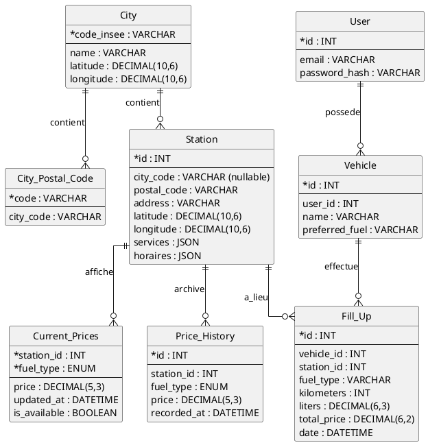
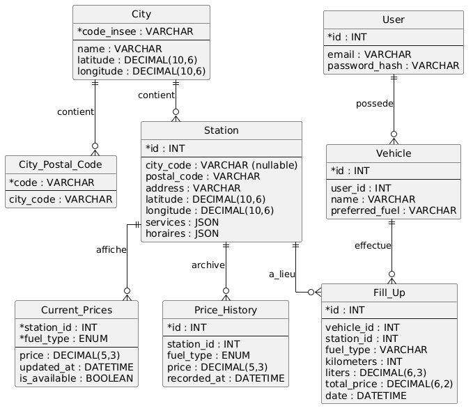

# DOCUMENT DE RÉFÉRENCE - "France Essence" (API INFO CARBURANTS) V1.4

## Vue d'ensemble

Projet de création d'une API backend permettant le suivi des prix des carburants en France (via l'Open Data du gouvernement) et la gestion de la consommation personnelle des utilisateurs.
**Stack technique :** Node.js, Express, TypeScript, SQLite, ORM (Prisma ou TypeORM), Architecture MVC.

---

## SECTION 1 : UTILISATEURS ET AUTHENTIFICATION

### 1.1 Niveaux d'accès
- **Accès Public (Non connecté)** : Consultation des stations, recherche par ville/géolocalisation, prix en temps réel, statistiques globales (moyennes).
- **Accès Privé (Connecté)** : Gestion de son/ses véhicule(s), ajout de pleins de carburant, suivi kilométrique, statistiques personnelles.

### 1.2 Système d'authentification
- **Méthode** : Authentification par Token (JWT) gérée via une librairie moderne.
- **Inscription/Connexion** : E-mail + Mot de passe (hashé via bcrypt ou argon2).
- **Sécurité** : Routes privées protégées par un middleware `isAuthenticated`.

---

## SECTION 2 : GESTION DES DONNÉES OPEN DATA (CRON & IMPORT)

### 2.1 Sources de données
1. **Carburants** : Flux gouvernemental `prix-carburants.gouv.fr`. Utilisation exclusive du fichier **Instantané + Ruptures** (`PrixCarburants_instantane_ruptures.xml` fourni en `.zip`).
  - Champs clés disponibles: `cp` (code postal), `ville` (nom texte), `latitude`, `longitude`, `services`, `horaires`, `prix`, `rupture`.
  - **Important**: le XML ne fournit pas le code INSEE.
2. **Villes** : Dataset `data.gouv.fr` (Fichier CSV).
  - Champs clés: `code_insee`, `nom_standard`, variantes de nom, `code_postal`, `codes_postaux`, `latitude_centre`, `longitude_centre`.

### 2.2 Stratégie d'importation (Historisation / Time-Series)
- **Script NPM initial** : `npm run import:data` initialise la BDD (Villes + Flux actuel).
- **Automatisation (CRON)** : Un CRON job tourne **toutes les heures** pour télécharger le fichier `instantane_rupture`.
  - *Note sur la limite technique (Le "trou" d'historique)* : Étant donné que nous téléchargeons un état à intervalle régulier, si un prix change plusieurs fois dans la même heure, les variations intermédiaires seront perdues. C'est un compromis technique assumé face à l'absence de Webhook gouvernemental.
- **Logique de mise à jour (Upsert & Idempotence)** :
  - L'import est **idempotent**. Une contrainte d'unicité `(station_id, fuel_type, recorded_at)` empêche la création de doublons si le CRON re-télécharge les mêmes données.
  - Si le prix lu est plus récent que celui en base : Insertion dans `price_history` (Append-only) et mise à jour de `current_prices`.
  - **Gestion des Ruptures** : 
    - Présence de `<rupture>` sans date de fin : `is_available` passe à `FALSE` dans `current_prices`.
    - Présence d'un nouveau `<prix>` pour un carburant en rupture : `is_available` repasse à `TRUE`.

  ### 2.3 Stratégie de correspondance Station → Ville
  Le XML ne contient pas le code INSEE, la correspondance se fait donc via les codes postaux, le nom de ville, et/ou la proximité GPS.

  1. **Méthode simple (déterministe)**
    - Normaliser les codes postaux (conserver 5 chiffres).
    - Normaliser les noms (majuscules + suppression des accents) pour comparer `pdv.ville` avec `nom_standard`.
    - Jointure par `cp` + nom normalisé si possible.

  2. **Méthode robuste (fallback)**
    - Si ambiguïté ou absence de nom fiable, utiliser la proximité: choisir la commune la plus proche des coordonnées du point de vente (`latitude`, `longitude`) parmi celles partageant le code postal.

  3. **Cas limites**
    - Codes postaux multiples (`codes_postaux`), CEDEX, homonymes, accents, variations de casse.
    - Les stations sans correspondance exacte doivent être conservées avec un `cityCode` vide et loggées pour analyse.

---

## SECTION 3 : FONCTIONNALITÉS PUBLIQUES (CARBURANTS)

### 3.1 Recherche Géolocalisée (Haversine & Bounding Box)
- **Endpoint** : `GET /api/v1/stations?lat=X&lng=Y&radius=10`
- **Rayon dynamique** : L'utilisateur peut spécifier la distance (ex: 10km, 25km, 50km).
- **Optimisation des performances** : SQLite n'étant pas optimisé nativement pour la géolocalisation, l'API utilise une stratégie en deux étapes :
  1. **Bounding Box (Pré-filtre SQL)** : Calcul en Node.js d'un "carré" autour du point (minLat, maxLat, minLng, maxLng) en fonction du rayon, appliqué dans un `WHERE` SQL. (Réduit le jeu de données de 10 000 à ~100 stations).
  2. **Haversine (Affinement)** : Calcul exact de la distance sur les résultats restants pour exclure les stations dans les coins du carré.
  - **Validation** : `lat` et `lng` sont obligatoires, `radius` en km (1-200), `limit` optionnel (max 500).
  - **Sortie** : Résultats triés par distance croissante.

### 3.2 Statistiques et Détails
- Moyennes nationales/départementales des prix par type de carburant.
- Détail d'une station (Adresse, services JSON, horaires) et son historique de prix récent.

### 3.3 Endpoint Station (MVP)
- **GET /api/v1/stations/:id**
  - Retourne les informations de la station + les prix courants.

---

## SECTION 4 : SUIVI DE CONSOMMATION (PRIVÉ)

### 4.1 Gestion des Véhicules et Pleins
- Déclaration de véhicules (Nom, Carburant préféré).
- Ajout d'un plein : Kilométrage, Litres ajoutés, Station où le plein a été fait, Type de carburant réellement mis.
- Le prix total peut être déduit automatiquement via `current_prices` (station + fuel_type + date). Si le prix n'est pas disponible, il est saisi manuellement.
- Statistiques personnelles : Consommation (L/100km), Coût (€/km).

---

## SECTION 5 : ARCHITECTURE ET DESIGN PATTERNS

### 5.1 Architecture MVC & Inversion de dépendance
```text
src/
├── config/             # Variables d'environnement, init DB, CRON
├── core/               # Interfaces, Exceptions personnalisées
├── controllers/        # Routage Express, parsing Zod
├── services/           # Logique métier pure (indépendante du framework HTTP)
├── repositories/       # Couche d'accès aux données (ORM - Prisma/TypeORM)
└── middlewares/        # Auth, Validation, Proxy Cache
```

### 5.2 Proxy Applicatif (Cache en Mémoire)
- **Concept** : Middleware de cache placé sur les routes publiques lourdes (ex: recherche géolocalisée).
- **Implémentation** : Cache en mémoire (In-Memory via Map ou librairie Node-Cache) avec un TTL (ex: 15 minutes).
- *Choix d'architecture* : Pour ce projet, Redis n'est pas implémenté afin de réduire la complexité de l'infrastructure, mais le pattern appliqué permettrait de l'intégrer facilement (inversion de dépendance du service de cache).
- **Sécurité** : Le cache est strictement désactivé sur les routes nécessitant un token JWT.

---

## SECTION 6 : BASE DE DONNÉES - STRUCTURE (SQLITE)

### 6.1 Tables et Index (Open Data)
```sql
cities
  - code_insee (PK, VARCHAR)
  - name (VARCHAR)
  - zip_code (VARCHAR)
  - latitude (DECIMAL(10, 6))
  - longitude (DECIMAL(10, 6))

city_postal_codes
  - code (VARCHAR)
  - city_code (FK -> cities.code_insee)

stations
  - id (PK, INT) -- ID officiel
  - address (VARCHAR)
  - city_code (FK -> cities.code_insee, nullable si non resolu)
  - postal_code (VARCHAR)
  - latitude (DECIMAL(10, 6))
  - longitude (DECIMAL(10, 6))
  - services (JSON) -- Liste des services
  - horaires (JSON)

current_prices (État actuel - Cache à chaud)
  - station_id (FK -> stations.id)
  - fuel_type (ENUM: 'SP95', 'Gazole', 'E85', 'GPLc', 'E10', 'SP98')
  - price (DECIMAL(5, 3))
  - updated_at (DATETIME)
  - is_available (BOOLEAN DEFAULT TRUE)

price_history (Historique - Append-only)
  - id (PK, AUTO_INCREMENT)
  - station_id (FK -> stations.id)
  - fuel_type (ENUM)
  - price (DECIMAL(5, 3))
  - recorded_at (DATETIME)
```
**Index BDD critiques pour les performances :**
- `stations(latitude, longitude)` (Pour la Bounding Box)
- `stations(city_code)`
- `stations(postal_code)`
- `city_postal_codes(code)`
- `current_prices(station_id, fuel_type)`
- `UNIQUE(station_id, fuel_type, recorded_at)` sur `price_history` (Garantit l'idempotence du CRON).

### 6.2 Tables Privées (Utilisateurs)
```sql
users
  - id (PK, AUTO_INCREMENT)
  - email (VARCHAR UNIQUE)
  - password_hash (VARCHAR)

vehicles
  - id (PK, AUTO_INCREMENT)
  - user_id (FK -> users.id)
  - name (VARCHAR)
  - preferred_fuel (VARCHAR)

fill_ups
  - id (PK, AUTO_INCREMENT)
  - vehicle_id (FK -> vehicles.id)
  - station_id (FK -> stations.id)
  - fuel_type (VARCHAR) -- Carburant réellement mis lors de ce plein
  - kilometers (INT)
  - liters (DECIMAL(6, 3)) -- Précision au millième de litre
  - total_price (DECIMAL(6, 2)) -- Calculé si `current_prices` est disponible, sinon saisi
  - date (DATETIME)
```

### 6.3 MCD (PlantUML)




---

## SECTION 9 : VALIDATION IMPORTS

Checklist rapide apres import:
1. `City import: totals` affiche un nombre de villes proche du nombre de lignes CSV (hors en-tete).
2. `postalCodes` et `indexedPostalCodeEntries` sont superieurs au nombre de villes (codes multiples).
3. `Fuel import: totals` affiche un `resolvedStations` proche du total, et les cas `none` sont rares.
4. Verifier quelques codes postaux critiques (ex: 75016, 13011, 69009) et confirmer que les stations ont un `city_code`.

## SECTION 7 : PROTOCOLES, SÉCURITÉ ET TESTS

### 7.1 RESTful API & Swagger
- L'API suit les standards REST.
- **Documentation** : Rédigée manuellement (`swagger.yaml`) pour maîtriser le contrat d'interface, exposée via `swagger-ui-express`.

### 7.2 Validation & Sécurité
- Validation stricte des Payloads et Query Params via **Zod**.
- Middleware d'erreur centralisé (Masquage des stacks traces en production).

### 7.4 Import automatique du XML (toutes les heures)
- Téléchargement: https://donnees.roulez-eco.fr/opendata/instantane_ruptures
- Le fichier `instantane_ruptures.zip` est téléchargé, extrait, puis importé depuis
  `data/PrixCarburants_instantane_ruptures.xml`.
- L'ancien XML est supprimé pour ne conserver que le dernier.

### 7.3 CI/CD et Tests
- Tests unitaires (Jest) sur la logique métier complexe (ex: Bounding Box, Haversine, Parsing XML).
- Pipeline CI basique (Linter, Type-check, exécution des tests).

---

## SECTION 8 : ÉVOLUTIONS POTENTIELLES (HORS MVP)
Afin de ne pas surcharger le livrable initial, les éléments suivants sont documentés comme évolutions futures :
1. **GraphQL** : Pour exposer des requêtes d'agrégation complexes et des graphiques sur mesure côté client.
2. **Filtrage par Services** : Normalisation de la colonne JSON `services` de la table `stations` en une table de liaison dédiée pour permettre des requêtes de type `?hasService=Lavage`.
3. **Redis** : Remplacement du cache en mémoire pour permettre le load-balancing multi-instances.
4. **gRPC / WebSockets** : Pour du streaming de prix en temps réel inter-microservices ou vers le client.